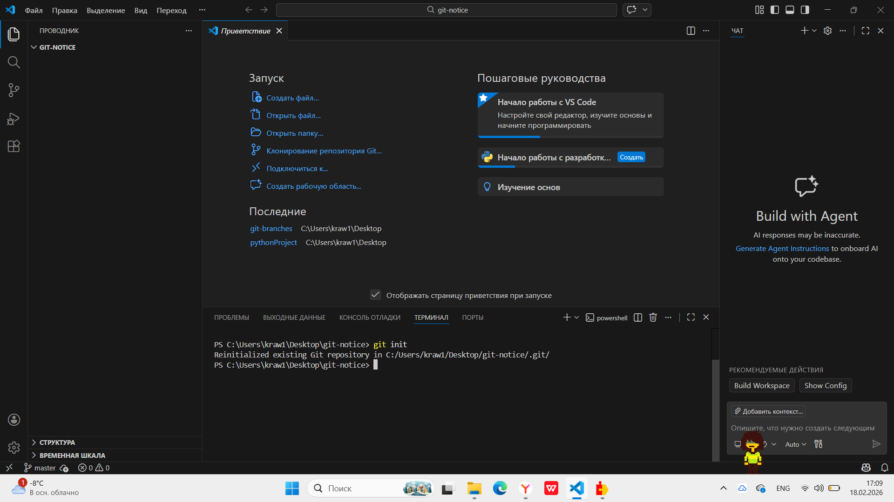
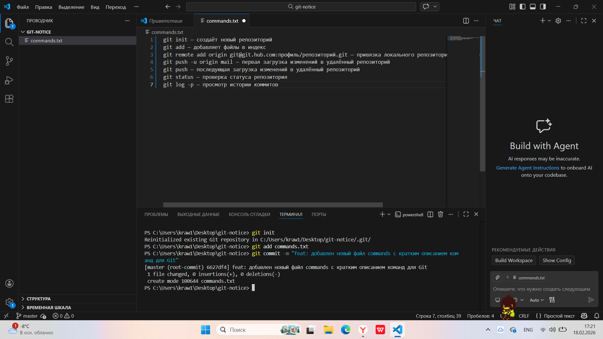
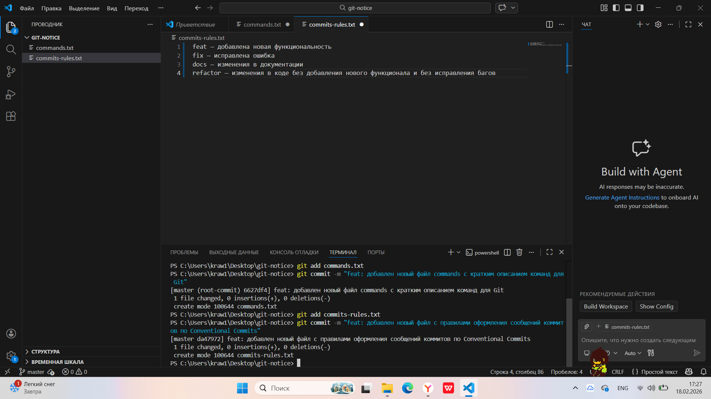
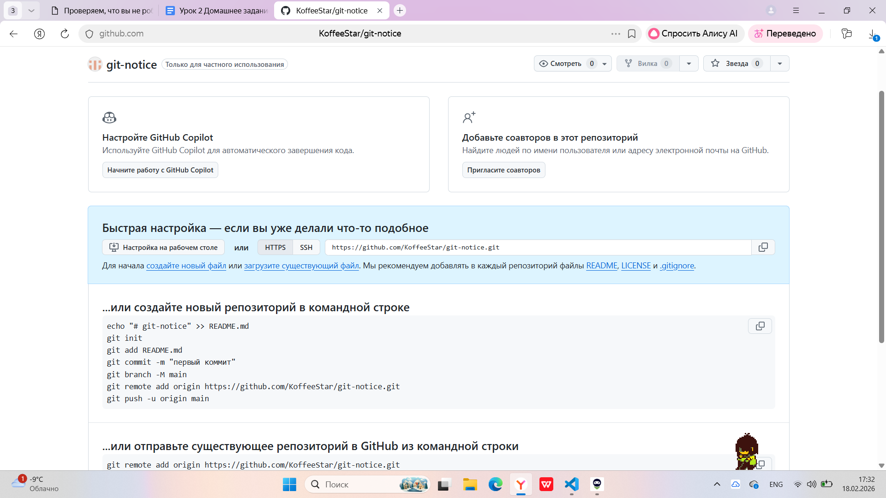
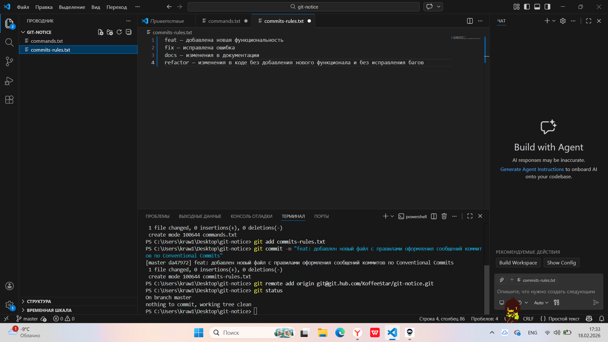
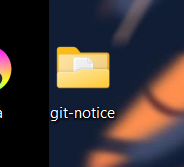

# Домашнее задание 1
### Содержание
- [Материалы задания](./solution)
- Выполненные задачи
- Скриншоты выполения задания
##### Выполненные задачи
- 1.Создана папка git-notice на рабочем столе и инициализирован новый репозиторий в ней.
- 2.Создан текстовый файл commands.txt со списоком основных команд Git и их кратким описанием.
- 3.Файл добавлен в индекс и сделан коммит.
- 4.Создан второй файл commits-rules.txt и в нём записаны правила оформления сообщений коммитов по Conventional Commits.
- 5.Файл добавлен в индекс и сделан второй коммит.
- 6.Создан новый репозиторий на GitHub с названием git-notice.
- 7.Локальный проект привязан к удалённому репозиторию.
##### Скриншоты выполнения задания

### Как использовать
1. Откройте материалы задания.
2. Внутри смотрите файлы `git-notice` (созданный репозиторий), скриншоты выполнения задания (показанные в этом)