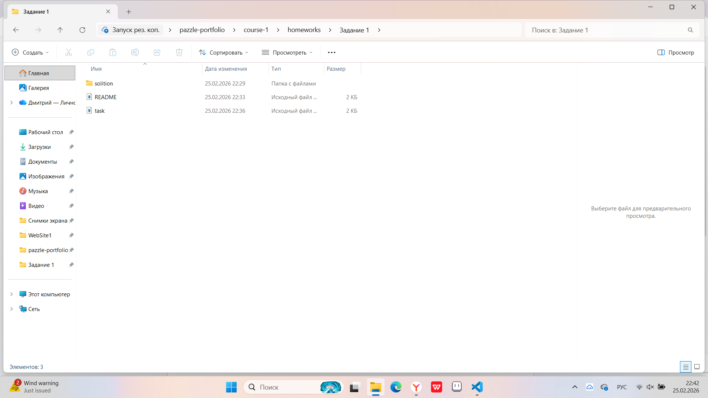
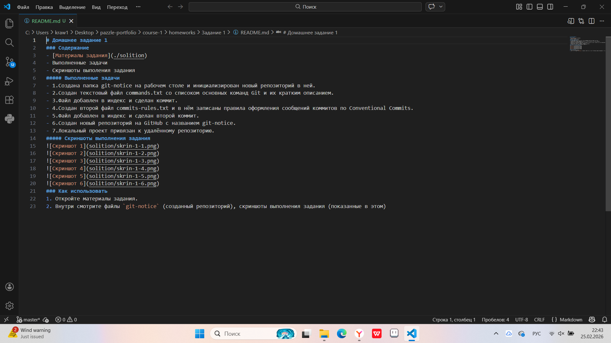
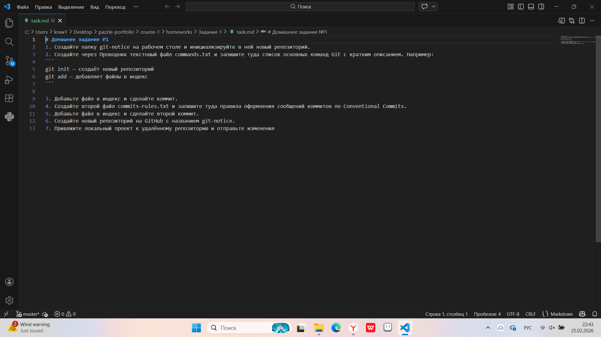

# Домашнее задание 2
### Содержание
- [Материалы задания](./solution)
- Выполненные задачи
- Скриншоты выполения задания
##### Выполненные задачи
- 1.Домашнее задание с прошлого урока перенесено в учебный репозиторий.
- 2.Оформлены файлы task.md и README.md.
##### Скриншоты выполнения задания

### Как использовать
1. Откройте папку задания 1.
2. Внутри смотрите файлы `task.md` и `README` (оформленные по заданию)
3. Откройте материалы задания.
4. Внутри смотрите скриншоты выполнения задания (показанные в этом файле)