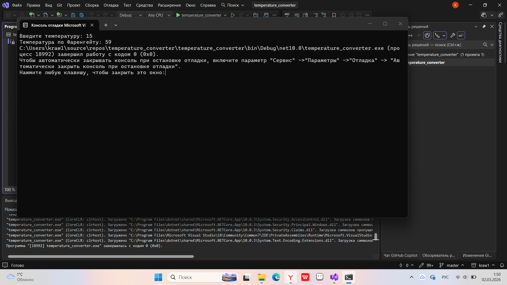
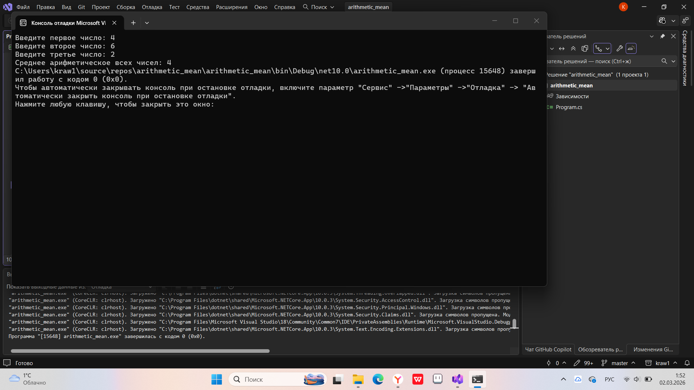
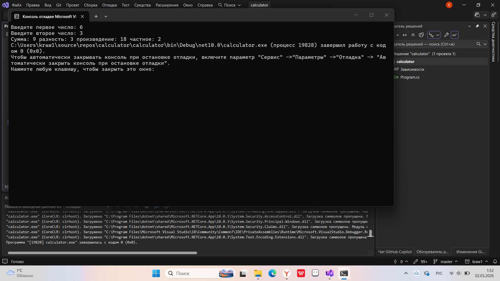

# Домашнее задание 3
### Содержание
- [Материалы задания](./solution)
- Выполненные задачи
- Скриншоты выполения задания
##### Выполненные задачи
- 1.Написан конвертер температуры.
- 2.Написана программа для нахождения среднеарифметического числа.
- 3.Написан калькулятор.
##### Скриншоты выполнения задания

### Как использовать
1. Откройте материалы задания.
2. Внутри смотрите файлы `temperature_converter`, `arithmetic_mean`, `calculator` и скриншоты выполнения задания (показанные в этом файле)