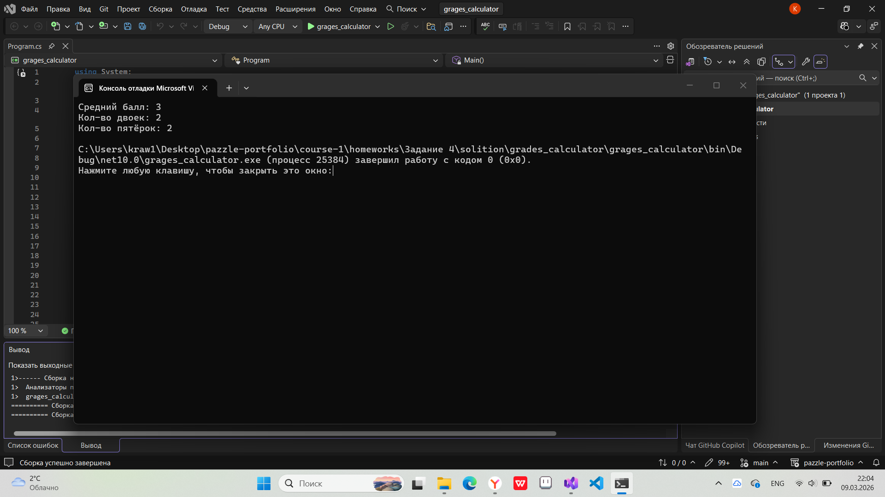
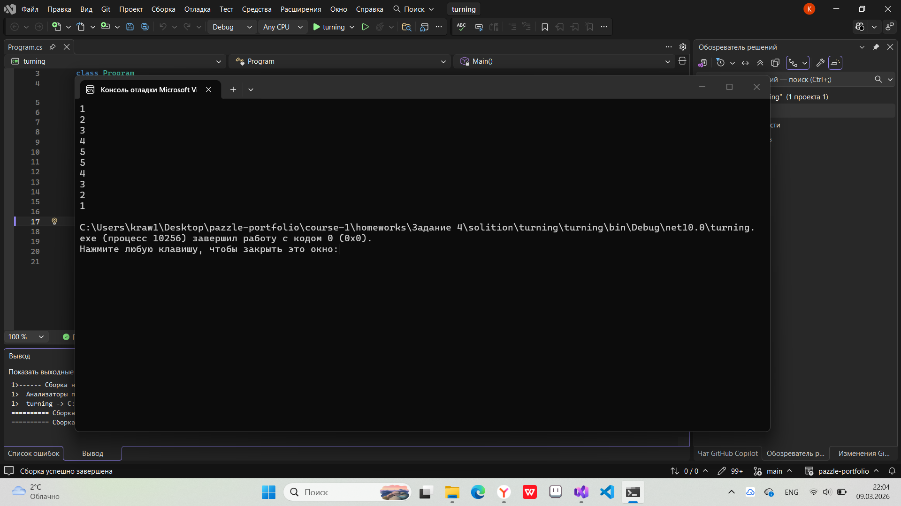
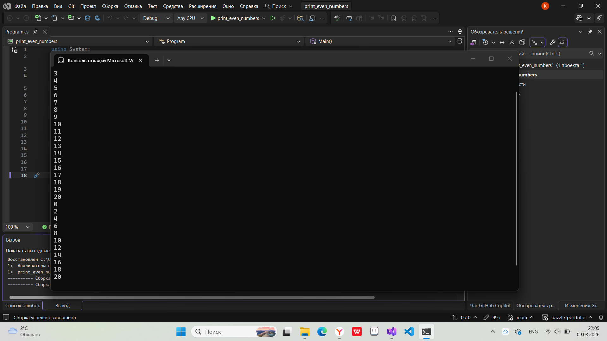
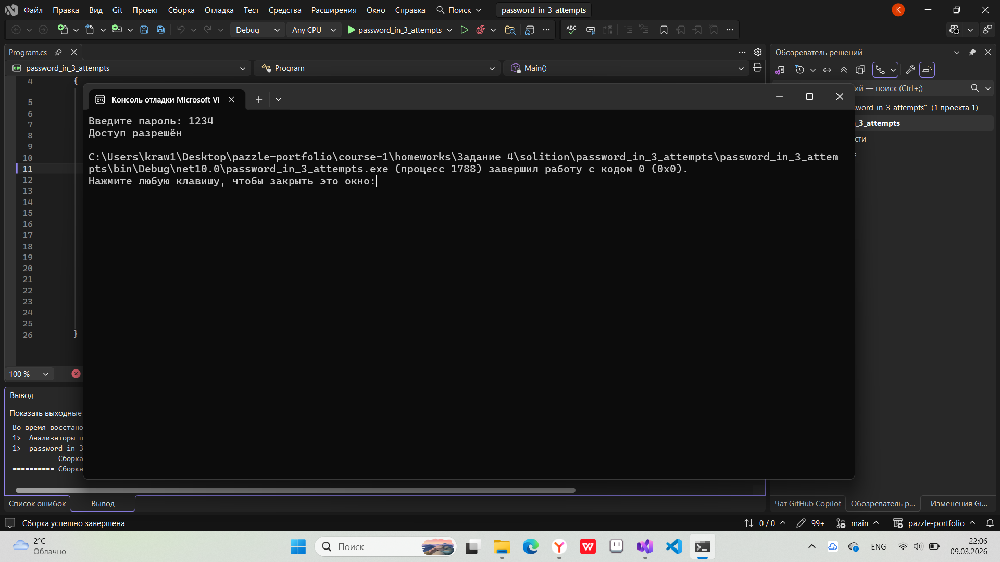
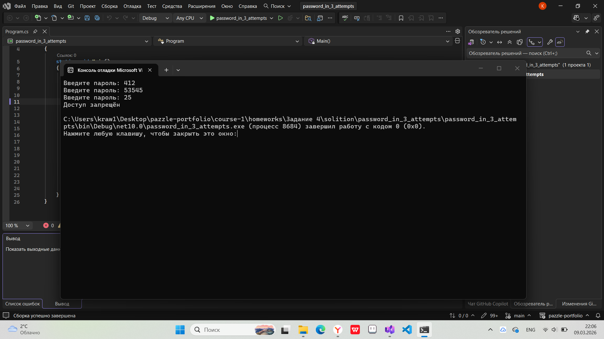
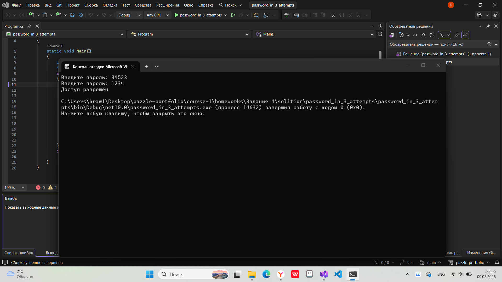

# Домашнее задание 4
### Содержание
- [Материалы задания](./solution)
- Выполненные задачи
- Скриншоты выполения задания
##### Выполненные задачи
- 1.Написан калькулятор оценок.
- 2.Написана программа для переворота массивов.
- 3.Написана программа для вывода чётных чисел.
- 4.Написана программа для ввода пароля с ограничением по попыткам.
##### Скриншоты выполнения задания

### Как использовать
1. Откройте материалы задания.
2. Внутри смотрите файлы `grades_calculator`, `turning`, `print_even_numbers`, `arithmetic_meanpassword_in_3_attempts` и скриншоты выполнения задания (показанные в этом файле)