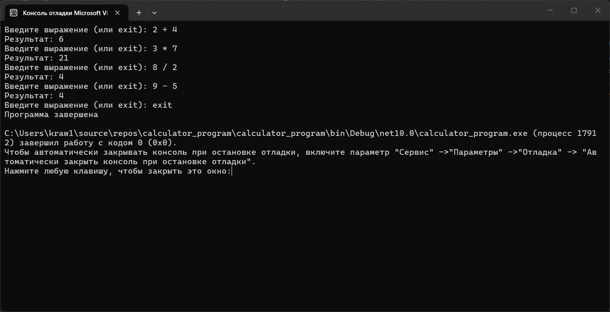
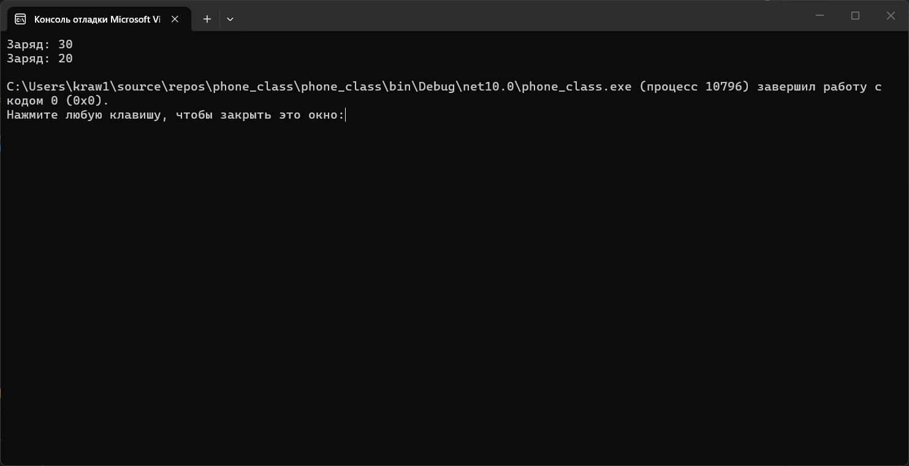

# Домашнее задание 5
### Содержание
- [Материалы задания](./solution)
- Выполненные задачи
- Скриншоты выполения задания
##### Выполненные задачи
- 1.Написана программа-калькулятор.
- 2.Создан класс Phone.
##### Скриншоты выполнения задания

### Как использовать
1. Откройте материалы задания.
2. Внутри смотрите файлы `calculator_program`, `phone_class` и скриншоты выполнения задания (показанные в этом файле)