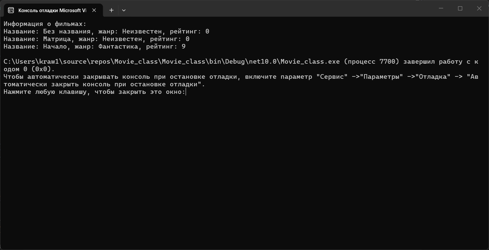
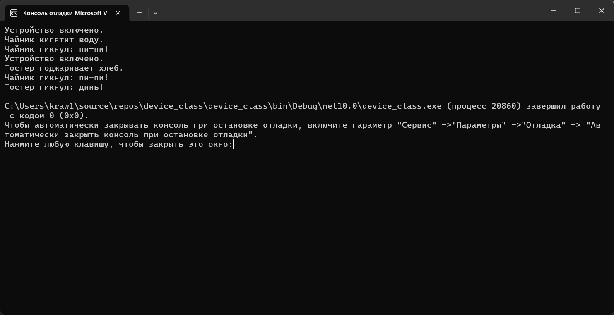

# Домашнее задание 6
### Содержание
- [Материалы задания](./solution)
- Выполненные задачи
- Скриншоты выполения задания
##### Выполненные задачи
- 1.Создан класс Movie.
- 2.Создан класс Device.
##### Скриншоты выполнения задания

### Как использовать
1. Откройте материалы задания.
2. Внутри смотрите файлы `device_class`, `movie_class` и скриншоты выполнения задания (показанные в этом файле)