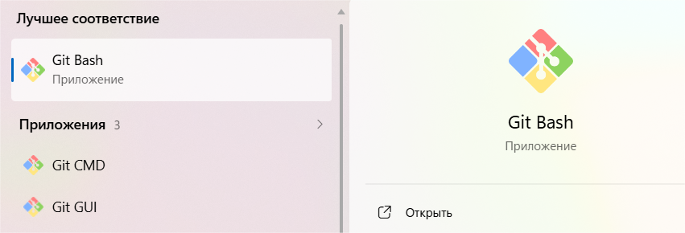
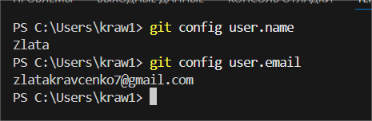
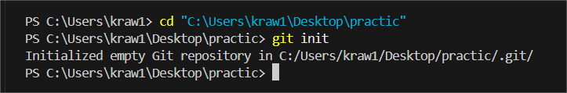
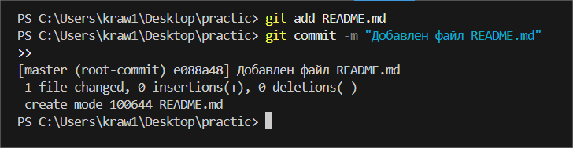

# Практика 1
### Содержание
- [Материалы задания](./solution)
- Выполненные задачи
- Скриншоты выполения задания
##### Выполненные задачи
- 1.Установлен Git.
- 2.Пройдена регистрация на Github.
- 3.Инициализирован репозиторий.
- 4.Создан файл README.md и сделан commit.
##### Скриншоты выполнения задания

### Как использовать
1. Откройте материалы задания.
2. Внутри смотрите скриншоты выполнения задания (показанные в этом)