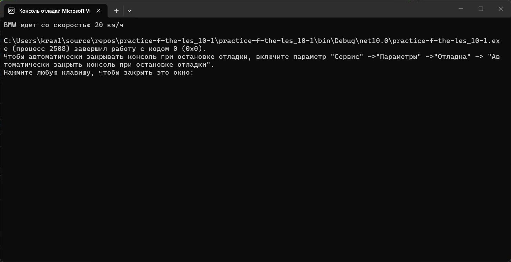

# Практика 10
### Содержание
- [Материалы задания](./solution)
- Выполненные задачи
- Скриншоты выполения задания
##### Выполненные задачи
- 1.Создан собственный класс.
- 2.Создан конструктор.
- 3.Создан класс Book.
- 4.Создан класс Library.
##### Скриншоты выполнения задания

### Как использовать
1. Откройте материалы задания.
2. Внутри смотрите файлы `practice-f-the-les_10-1`, `practice-f-the-les_10-2`, `practice-f-the-les_10-3`, `practice-f-the-les_10-4` и скриншоты выполнения задания (показанные в этом)