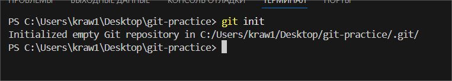
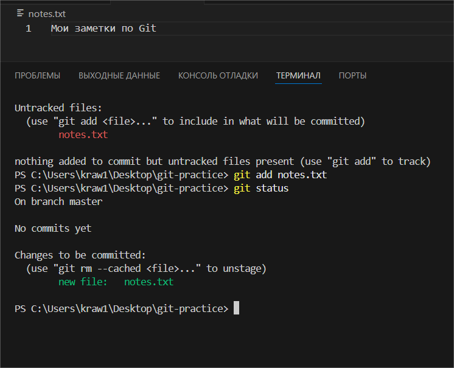
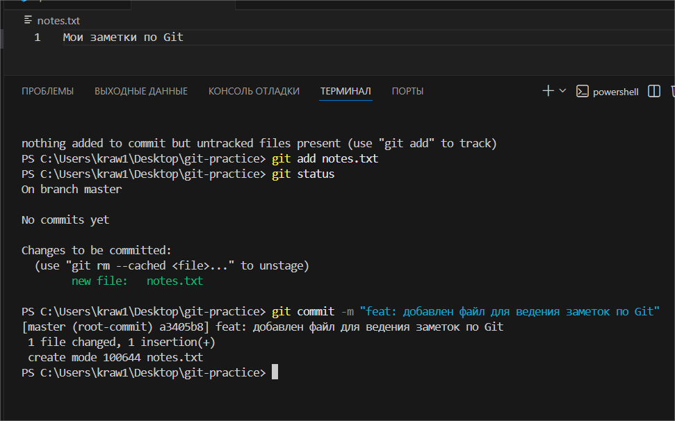
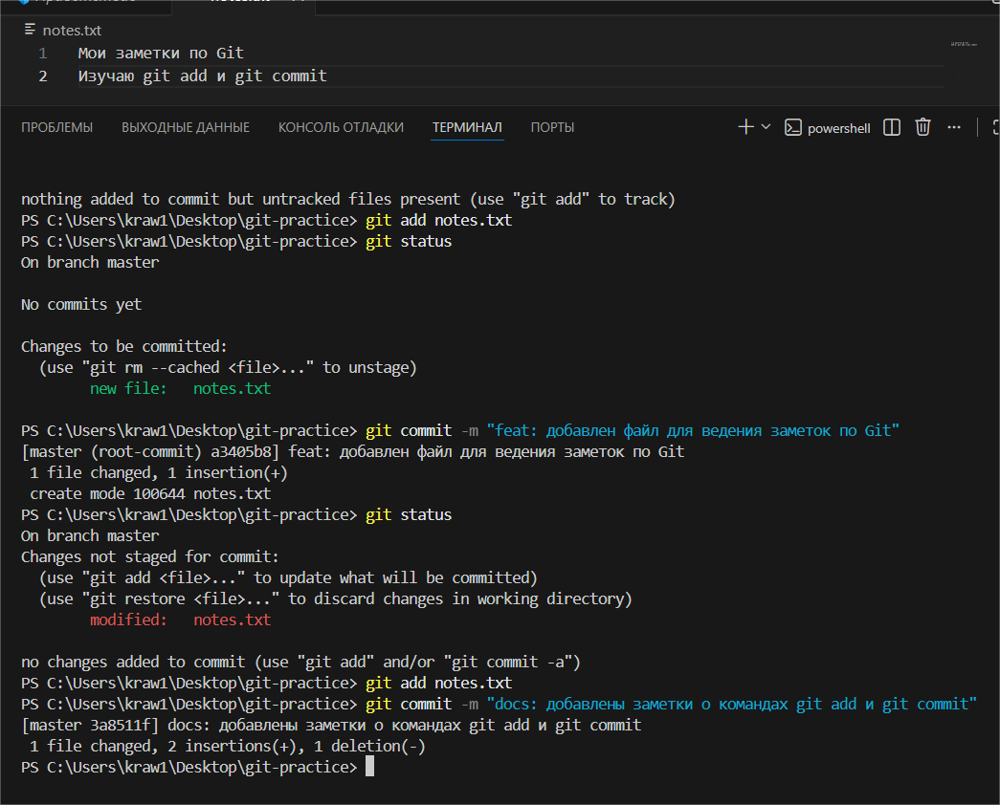
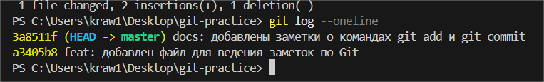
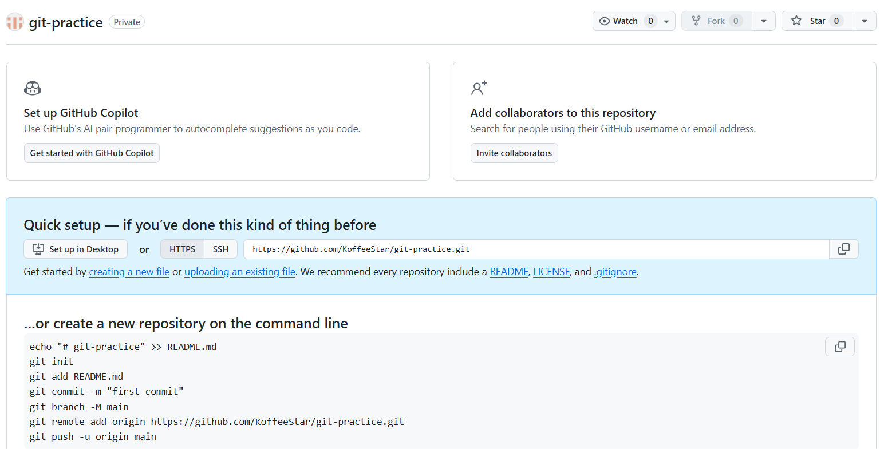
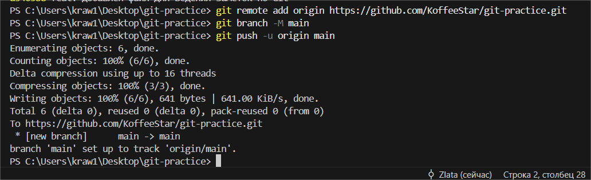
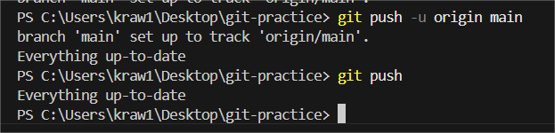

# Практика 2
### Содержание
- [Материалы задания](./solution)
- Выполненные задачи
- Скриншоты выполения задания
##### Выполненные задачи
- 1.Создан и инициализирован проект.
- 2.Создан и добавлен индекс в файл.
- 3.Создан коммит.
- 4.Изменён файл и сделан новый коммит.
- 5.Проверена история коммитов.
- 6.Выполнена привязка к удаленному репозиторию.
- 7.Отправлены изменения на Github.
##### Скриншоты выполнения задания

### Как использовать
1. Откройте материалы задания.
2. Внутри смотрите скриншоты выполнения задания (показанные в этом)