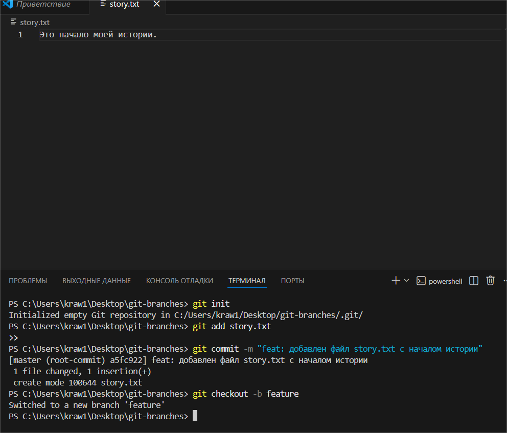
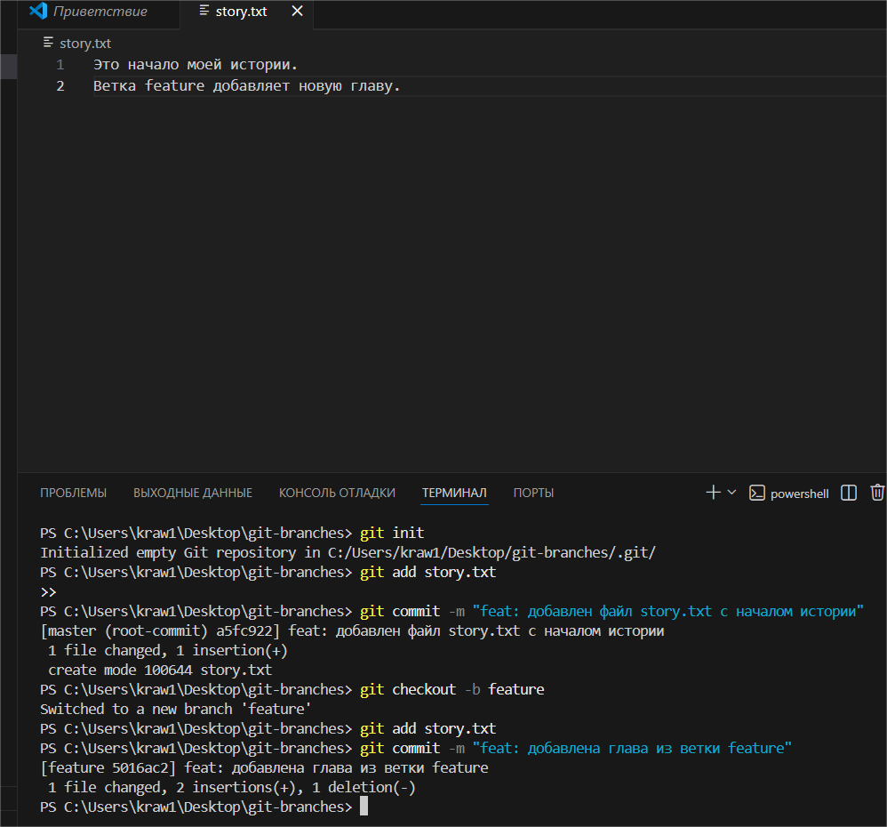
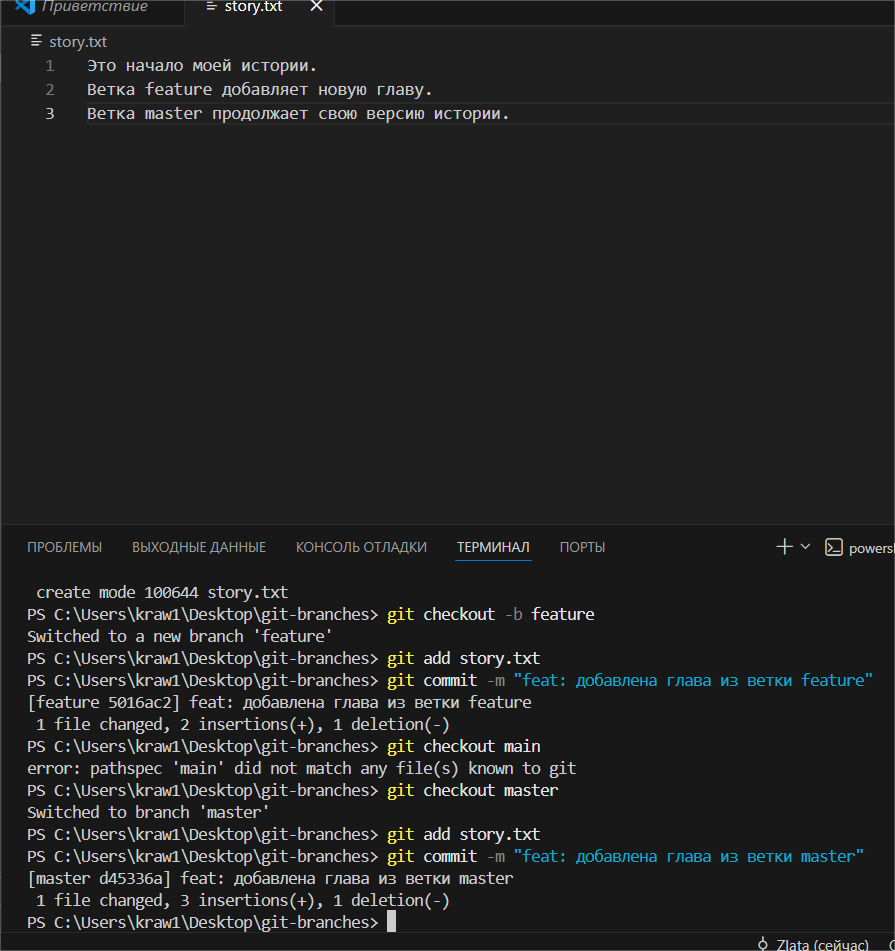
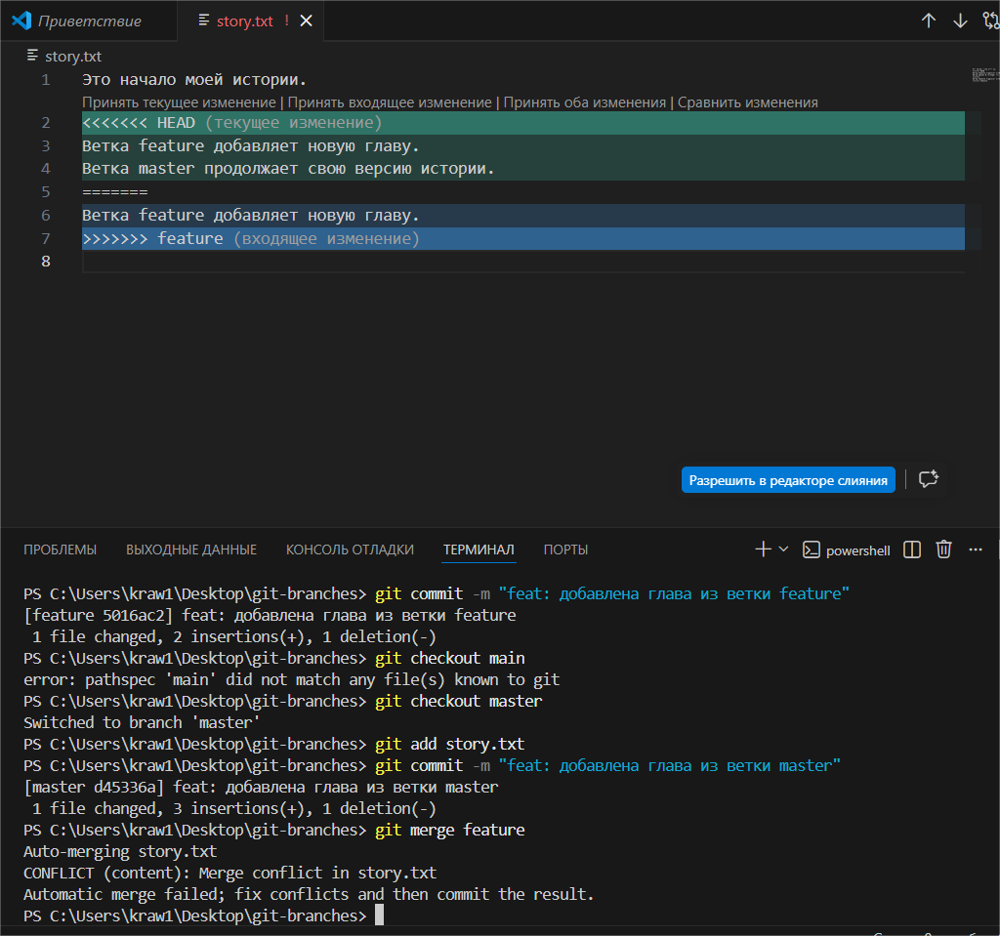
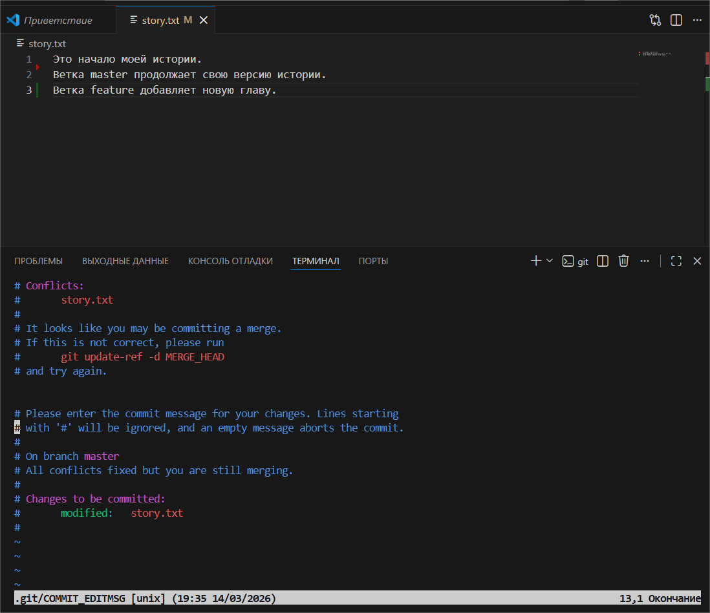

# Практика 3
### Содержание
- [Материалы задания](./solution)
- Выполненные задачи
- Скриншоты выполения задания
##### Выполненные задачи
- 1.Создан репозиторий с ветками.
- 2.Измененён файл в ветке feature.
- 3.Измененён файл в ветке main.
- 4.Изменён файл и сделан новый коммит.
- 5.Вызван merge-конфликт.
- 6.Разрешён merge-конфликт.
- 7.Отправлены изменения на Github.
##### Скриншоты выполнения задания

### Как использовать
1. Откройте материалы задания.
2. Внутри смотрите скриншоты выполнения задания (показанные в этом)