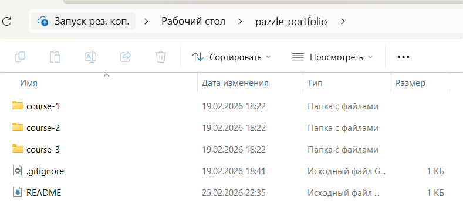
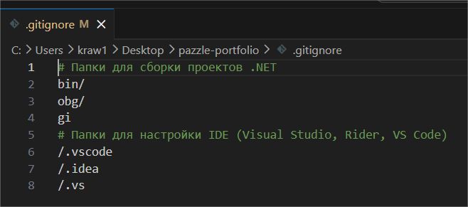
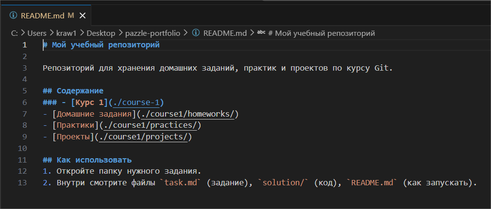

# Практика 4
### Содержание
- [Материалы задания](./solution)
- Выполненные задачи
- Скриншоты выполения задания
##### Выполненные задачи
- 1.Создан репозиторий.
- 2.Добавлен .gitignore.
- 3.Добавлен README.md.
##### Скриншоты выполнения задания

### Как использовать
1. Откройте материалы задания.
2. Внутри смотрите скриншоты выполнения задания (показанные в этом)