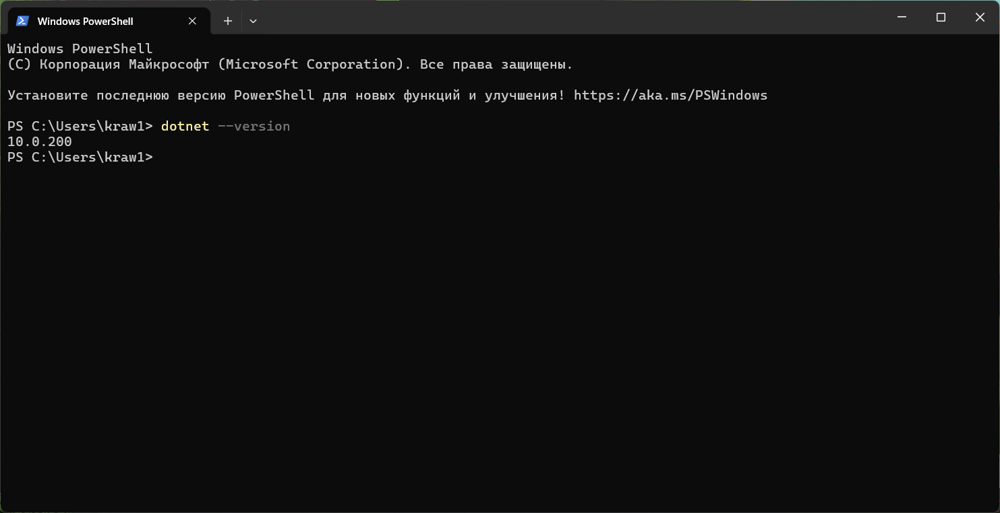
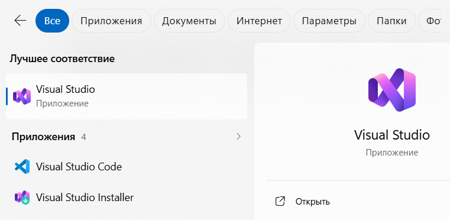
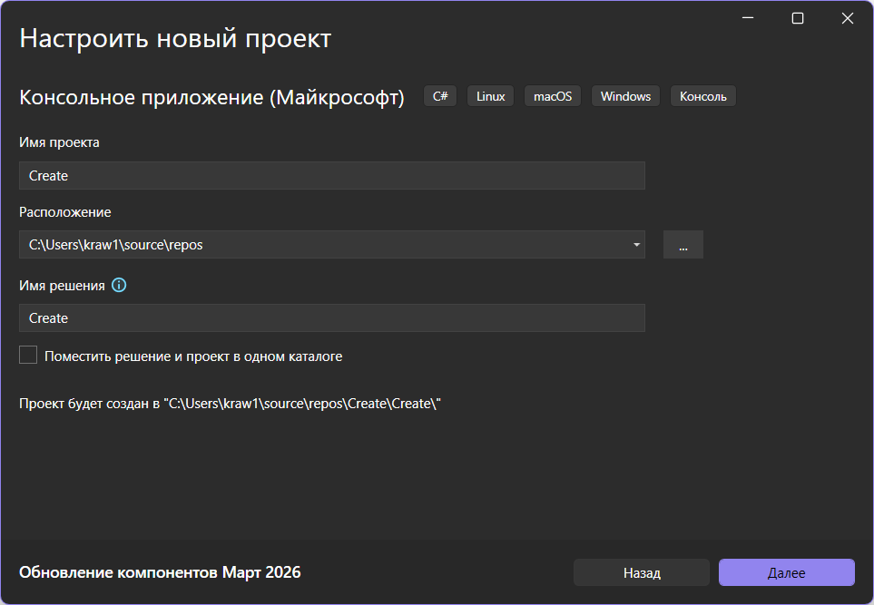
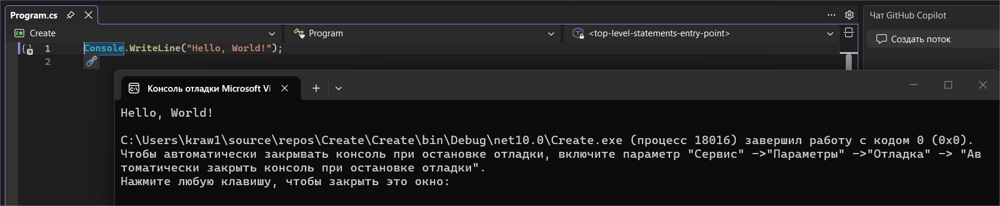

# Практика 5
### Содержание
- [Материалы задания](./solution)
- Выполненные задачи
- Скриншоты выполения задания
##### Выполненные задачи
- 1.Установлен .NET SD.
- 2.Установлен Visual Studio.
- 3.Создан проект.
- 4.Осуществлён первый запуск.
##### Скриншоты выполнения задания

### Как использовать
1. Откройте материалы задания.
2. Внутри смотрите скриншоты выполнения задания (показанные в этом)