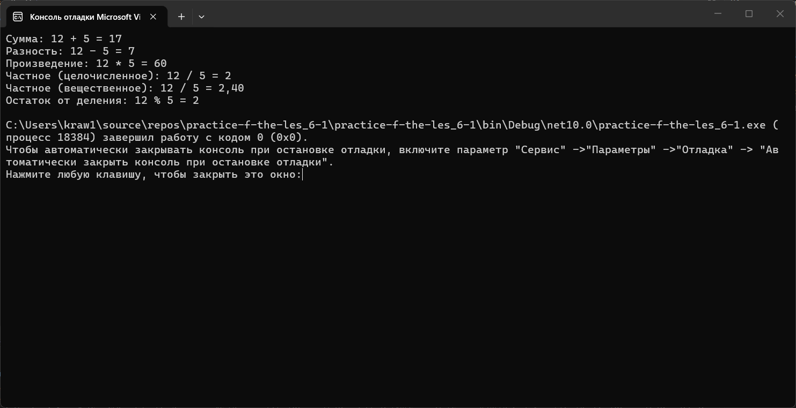
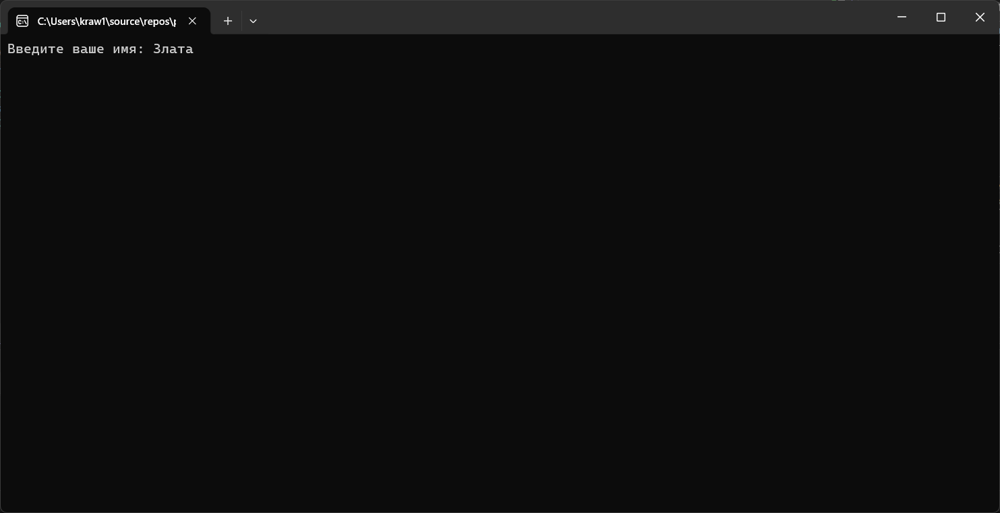
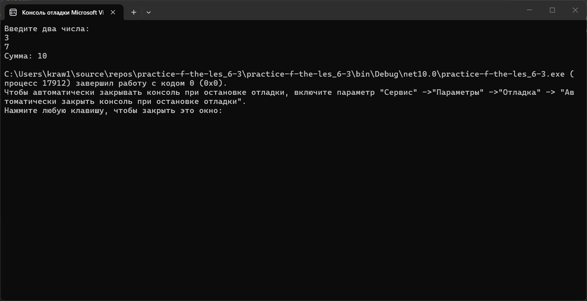
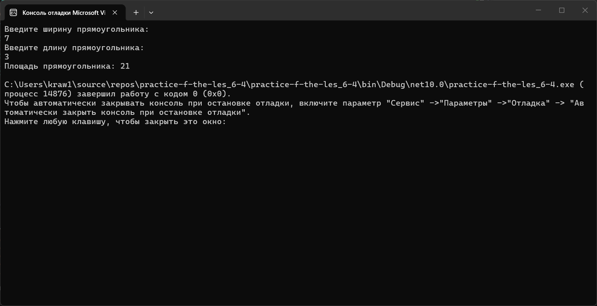

# Практика 8
### Содержание
- [Материалы задания](./solution)
- Выполненные задачи
- Скриншоты выполения задания
##### Выполненные задачи
- 1.Написан код для проведения арифметических операций над переменными.
- 2.Написан код для работы с вводом/выводом в консоль.
- 3.Написан код для нахождения суммы двух чисел.
- 4.Написан код для расчёта площади прямоугольника.
##### Скриншоты выполнения задания

### Как использовать
1. Откройте материалы задания.
2. Внутри смотрите файлы `practice-f-the-les_6-1`, `practice-f-the-les_6-2`, `practice-f-the-les_6-3`, `practice-f-the-les_6-4` и скриншоты выполнения задания (показанные в этом)