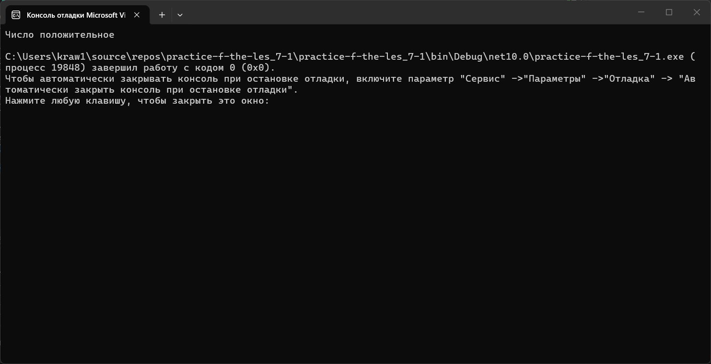
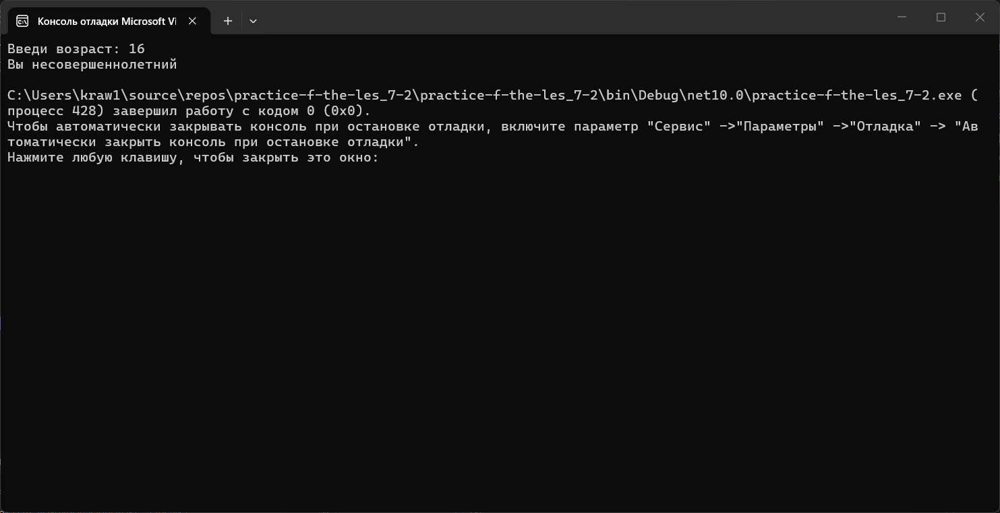
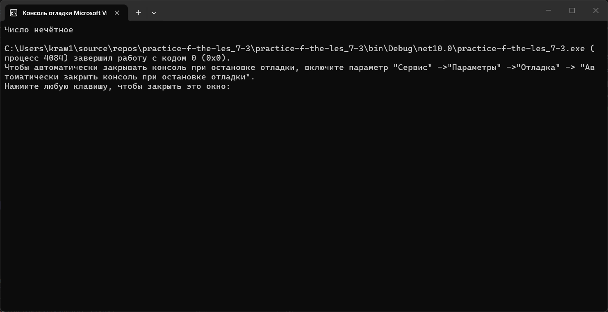
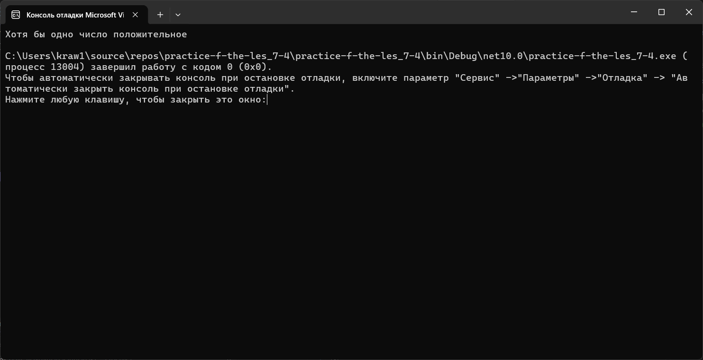
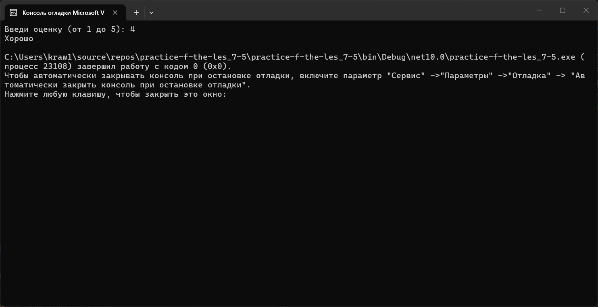

# Практика 7
### Содержание
- [Материалы задания](./solution)
- Выполненные задачи
- Скриншоты выполения задания
##### Выполненные задачи
- 1.Написан код для проверки числа.
- 2.Написан код для проверки возраста.
- 3.Написан код для проверки чётности числа.
- 4.Написан код для работы с логическими операторами.
- 5.Написан калькулятор оценок.
##### Скриншоты выполнения задания

### Как использовать
1. Откройте материалы задания.
2. Внутри смотрите файлы `practice-f-the-les_7-1`, `practice-f-the-les_7-2`, `practice-f-the-les_7-3`, `practice-f-the-les_7-4`, `practice-f-the-les_7-5` и скриншоты выполнения задания (показанные в этом)