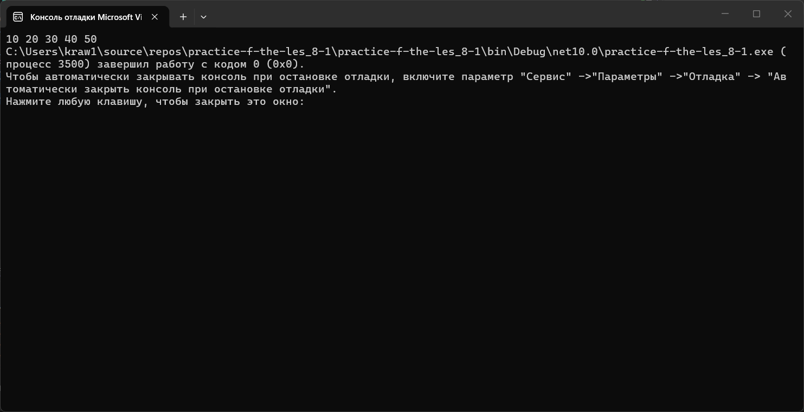
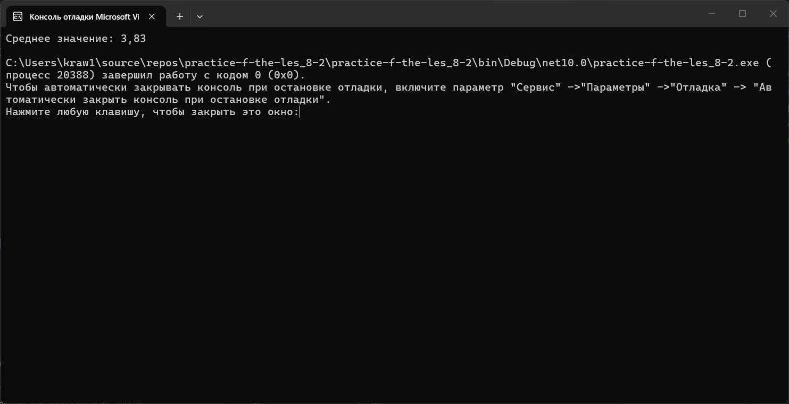
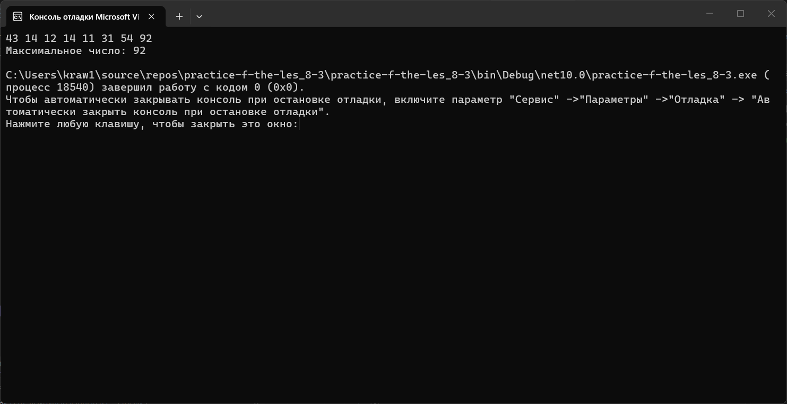
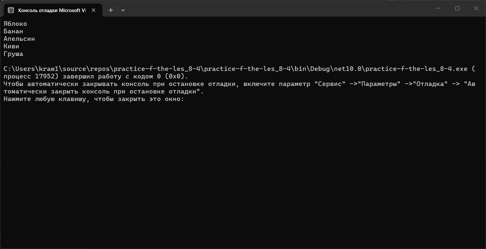
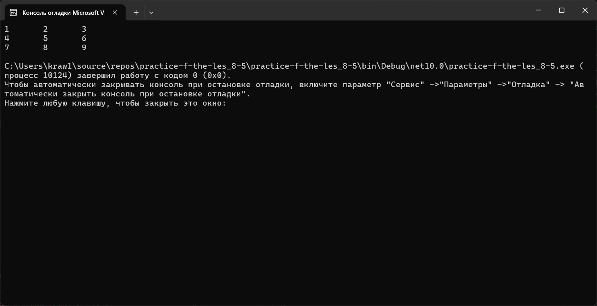

# Практика 8
### Содержание
- [Материалы задания](./solution)
- Выполненные задачи
- Скриншоты выполения задания
##### Выполненные задачи
- 1.Написан код для создания массива.
- 2.Написан код для поиска среднего арифметического.
- 3.Написан код для поиска максимального числа.
- 4.Написан код для работы с foreach.
- 5.Написан код для создания двумерного массива.
##### Скриншоты выполнения задания

### Как использовать
1. Откройте материалы задания.
2. Внутри смотрите файлы `practice-f-the-les_8-1`, `practice-f-the-les_8-2`, `practice-f-the-les_8-3`, `practice-f-the-les_8-4` и скриншоты выполнения задания (показанные в этом)