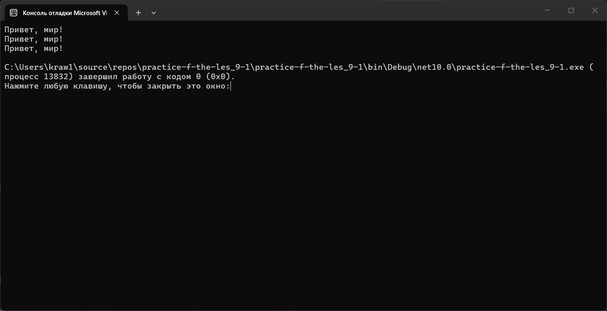
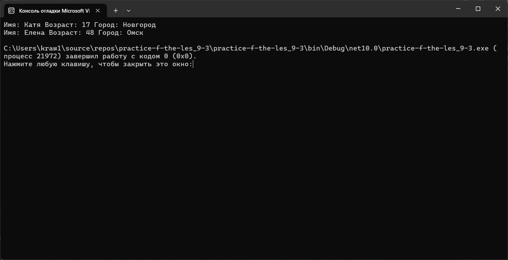
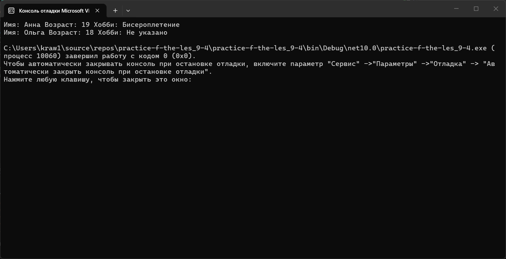
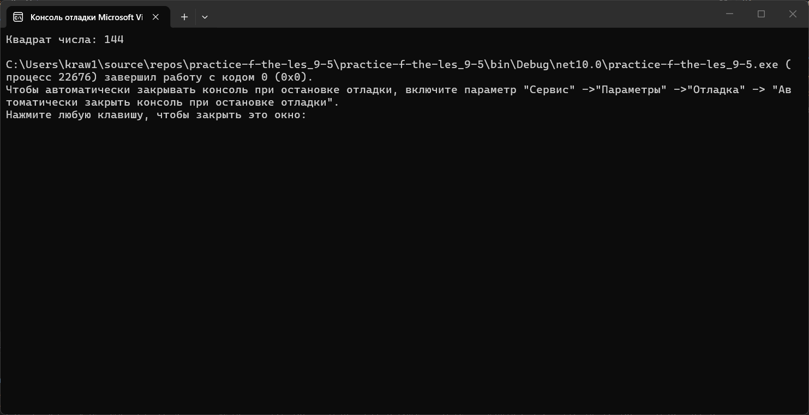
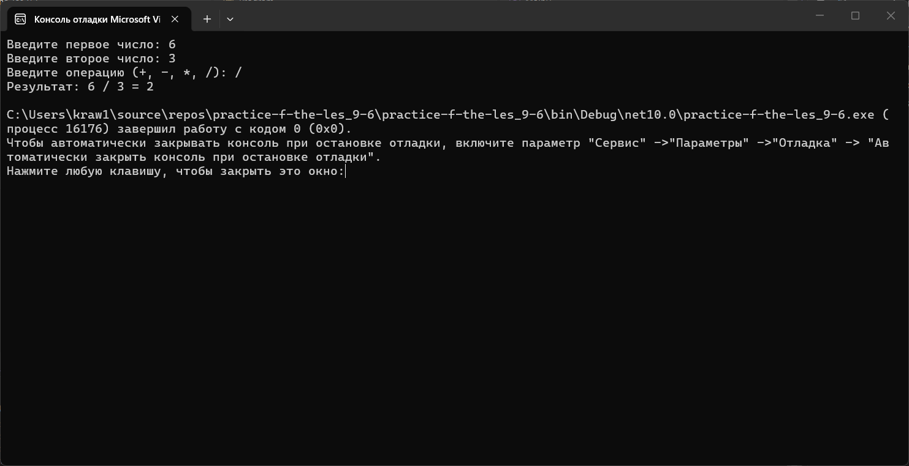
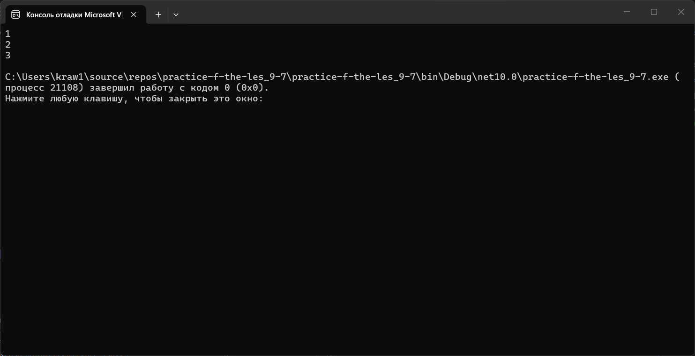
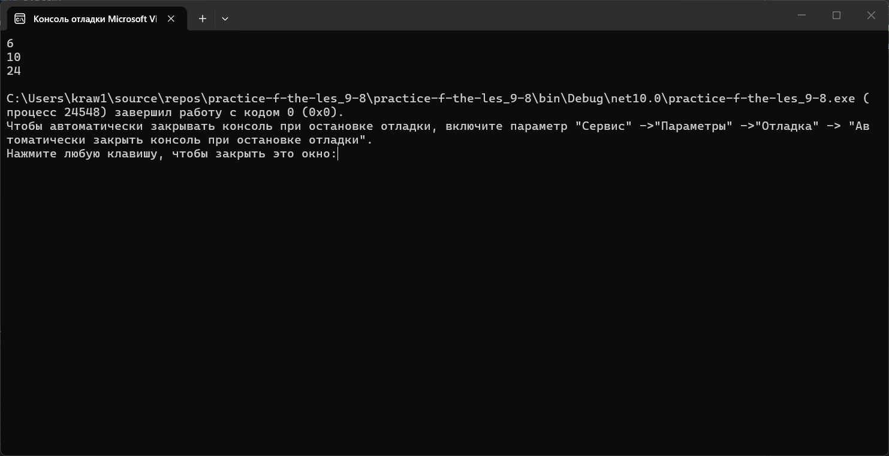

# Практика 9
### Содержание
- [Материалы задания](./solution)
- Выполненные задачи
- Скриншоты выполения задания
##### Выполненные задачи
- 1.Создан метод вывода приветствия.
- 2.Создан метод с параметром.
- 3.Создан метод вывода информации о пользователе.
- 4.Создан метод с необязательными параметрами.
- 5.Создан метод с возвращаемым значением.
- 6.Создан метод-калькулятор.
- 7.Создан метод, где значение играет область видимости.
- 8.Создан метод с разными версиями.
##### Скриншоты выполнения задания

### Как использовать
1. Откройте материалы задания.
2. Внутри смотрите файлы `practice-f-the-les_9-1`, `practice-f-the-les_9-2`, `practice-f-the-les_9-3`, `practice-f-the-les_9-4`, `practice-f-the-les_9-5`, `practice-f-the-les_9-6`, `practice-f-the-les_9-7`, `practice-f-the-les_9-8` и скриншоты выполнения задания (показанные в этом)